# [📈 Live Status](https://uptime.alliancecomp.com): <!--live status--> **🟩 All systems operational**

This repository contains the open-source uptime monitor and status page for [alliancewebteam](https://uptime.alliancecomp.com), powered by [Upptime](https://github.com/upptime/upptime).

With [Upptime](https://upptime.js.org), you can get your own unlimited and free uptime monitor and status page, powered entirely by a GitHub repository. We use [Issues](https://github.com/alliancewebteam/uptime/issues) as incident reports, [Actions](https://github.com/alliancewebteam/uptime/actions) as uptime monitors, and [Pages](https://uptime.alliancecomp.com) for the status page.

<!--start: status pages-->
<!-- This summary is generated by Upptime (https://github.com/upptime/upptime) -->
<!-- Do not edit this manually, your changes will be overwritten -->
<!-- prettier-ignore -->
| URL | Status | History | Response Time | Uptime |
| --- | ------ | ------- | ------------- | ------ |
|  [Alliance Computers](https://alliancecomp.com) | 🟩 Up | [alliance-computers.yml](https://github.com/alliancewebteam/uptime/commits/HEAD/history/alliance-computers.yml) | 

 2342ms
     
 | 

<a href="https://uptime.alliancecomp.com/history/alliance-computers">100.00%</a>
    

|  [Allied Group PA](https://alliedgrouppa.com) | 🟩 Up | [allied-group-pa.yml](https://github.com/alliancewebteam/uptime/commits/HEAD/history/allied-group-pa.yml) | 

 1099ms
     
 | 

<a href="https://uptime.alliancecomp.com/history/allied-group-pa">100.00%</a>
    

|  [A Plus Mortgage Solutions](https://aplusmortgagesolutions.com) | 🟩 Up | [a-plus-mortgage-solutions.yml](https://github.com/alliancewebteam/uptime/commits/HEAD/history/a-plus-mortgage-solutions.yml) | 

 159ms
     
 | 

<a href="https://uptime.alliancecomp.com/history/a-plus-mortgage-solutions">100.00%</a>
    

|  [Arthrex Lancaster](https://arthrex-lancaster.com) | 🟩 Up | [arthrex-lancaster.yml](https://github.com/alliancewebteam/uptime/commits/HEAD/history/arthrex-lancaster.yml) | 

 1925ms
     
 | 

<a href="https://uptime.alliancecomp.com/history/arthrex-lancaster">96.05%</a>
    

|  [Arthrex New York City](https://arthrex-newyorkcity.com) | 🟩 Up | [arthrex-new-york-city.yml](https://github.com/alliancewebteam/uptime/commits/HEAD/history/arthrex-new-york-city.yml) | 

 422ms
     
 | 

<a href="https://uptime.alliancecomp.com/history/arthrex-new-york-city">96.57%</a>
    

|  [Aztec Rental Services](https://aztecrentalservices.com) | 🟩 Up | [aztec-rental-services.yml](https://github.com/alliancewebteam/uptime/commits/HEAD/history/aztec-rental-services.yml) | 

 145ms
     
 | 

<a href="https://uptime.alliancecomp.com/history/aztec-rental-services">100.00%</a>
    

|  [Be Inspired Salon](https://beinspiredsalonpa.com) | 🟩 Up | [be-inspired-salon.yml](https://github.com/alliancewebteam/uptime/commits/HEAD/history/be-inspired-salon.yml) | 

 103ms
     
 | 

<a href="https://uptime.alliancecomp.com/history/be-inspired-salon">0.00%</a>
    

|  [Boswell, Tinter, Piccola LLC](https://btpalaw.com) | 🟩 Up | [boswell-tinter-piccola-llc.yml](https://github.com/alliancewebteam/uptime/commits/HEAD/history/boswell-tinter-piccola-llc.yml) | 

 92ms
     
 | 

<a href="https://uptime.alliancecomp.com/history/boswell-tinter-piccola-llc">100.00%</a>
    

|  [Boyo Transportation](https://boyotrans.com) | 🟩 Up | [boyo-transportation.yml](https://github.com/alliancewebteam/uptime/commits/HEAD/history/boyo-transportation.yml) | 

 739ms
     
 | 

<a href="https://uptime.alliancecomp.com/history/boyo-transportation">100.00%</a>
    

|  [Bricks & Sticks Title Agency](https://bns-settlements.com) | 🟩 Up | [bricks-and-sticks-title-agency.yml](https://github.com/alliancewebteam/uptime/commits/HEAD/history/bricks-and-sticks-title-agency.yml) | 

 128ms
     
 | 

<a href="https://uptime.alliancecomp.com/history/bricks-and-sticks-title-agency">100.00%</a>
    

|  [Bucher Group](https://buchergroup.com) | 🟩 Up | [bucher-group.yml](https://github.com/alliancewebteam/uptime/commits/HEAD/history/bucher-group.yml) | 

 2574ms
     
 | 

<a href="https://uptime.alliancecomp.com/history/bucher-group">98.55%</a>
    

|  [Buckland Sales](https://bucklandsales.com) | 🟩 Up | [buckland-sales.yml](https://github.com/alliancewebteam/uptime/commits/HEAD/history/buckland-sales.yml) | 

 348ms
     
 | 

<a href="https://uptime.alliancecomp.com/history/buckland-sales">98.60%</a>
    

|  [Cantate Carlisle](https://cantatecarlisle.org) | 🟩 Up | [cantate-carlisle.yml](https://github.com/alliancewebteam/uptime/commits/HEAD/history/cantate-carlisle.yml) | 

 1560ms
     
 | 

<a href="https://uptime.alliancecomp.com/history/cantate-carlisle">100.00%</a>
    

|  [Carlisle Theatre](https://carlisletheatre.org) | 🟩 Up | [carlisle-theatre.yml](https://github.com/alliancewebteam/uptime/commits/HEAD/history/carlisle-theatre.yml) | 

 783ms
     
 | 

<a href="https://uptime.alliancecomp.com/history/carlisle-theatre">100.00%</a>
    

|  [Capital Hospitality Services](chshotelrenovations.com) | 🟩 Up | [capital-hospitality-services.yml](https://github.com/alliancewebteam/uptime/commits/HEAD/history/capital-hospitality-services.yml) | 

 143ms
     
 | 

<a href="https://uptime.alliancecomp.com/history/capital-hospitality-services">100.00%</a>
    

|  [Capital Senior Services LLC](https://capitalseniorservices.com) | 🟩 Up | [capital-senior-services-llc.yml](https://github.com/alliancewebteam/uptime/commits/HEAD/history/capital-senior-services-llc.yml) | 

 448ms
     
 | 

<a href="https://uptime.alliancecomp.com/history/capital-senior-services-llc">100.00%</a>
    

|  [Carpe Diem Nutrition](https://carpediemnutrition.com) | 🟩 Up | [carpe-diem-nutrition.yml](https://github.com/alliancewebteam/uptime/commits/HEAD/history/carpe-diem-nutrition.yml) | 

 153ms
     
 | 

<a href="https://uptime.alliancecomp.com/history/carpe-diem-nutrition">100.00%</a>
    

|  [Center For Independent Living](https://cilofyaf.org) | 🟩 Up | [center-for-independent-living.yml](https://github.com/alliancewebteam/uptime/commits/HEAD/history/center-for-independent-living.yml) | 

 132ms
     
 | 

<a href="https://uptime.alliancecomp.com/history/center-for-independent-living">100.00%</a>
    

|  [Christ Evangelical Lutheran Church](https://churchonthehilltop.org) | 🟩 Up | [christ-evangelical-lutheran-church.yml](https://github.com/alliancewebteam/uptime/commits/HEAD/history/christ-evangelical-lutheran-church.yml) | 

 226ms
     
 | 

<a href="https://uptime.alliancecomp.com/history/christ-evangelical-lutheran-church">100.00%</a>
    

|  [Christ Presbyterian Church](https://christchurchcamphill.org) | 🟩 Up | [christ-presbyterian-church.yml](https://github.com/alliancewebteam/uptime/commits/HEAD/history/christ-presbyterian-church.yml) | 

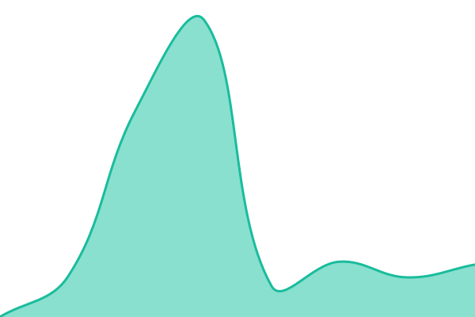 1583ms
     
 | 

<a href="https://uptime.alliancecomp.com/history/christ-presbyterian-church">100.00%</a>
    

|  [Control Systems 21](https://controlsystems21.com) | 🟩 Up | [control-systems-21.yml](https://github.com/alliancewebteam/uptime/commits/HEAD/history/control-systems-21.yml) | 

 132ms
     
 | 

<a href="https://uptime.alliancecomp.com/history/control-systems-21">100.00%</a>
    

|  [Compassionate Communications](https://compassionatecommunications.net) | 🟩 Up | [compassionate-communications.yml](https://github.com/alliancewebteam/uptime/commits/HEAD/history/compassionate-communications.yml) | 

 65ms
     
 | 

<a href="https://uptime.alliancecomp.com/history/compassionate-communications">100.00%</a>
    

|  [County Seat Self Storage](https://www.countyseatselfstorage.com) | 🟩 Up | [county-seat-self-storage.yml](https://github.com/alliancewebteam/uptime/commits/HEAD/history/county-seat-self-storage.yml) | 

 340ms
     
 | 

<a href="https://uptime.alliancecomp.com/history/county-seat-self-storage">100.00%</a>
    

|  [CMB Contracting](https://cmbcontractingservices.com) | 🟩 Up | [cmb-contracting.yml](https://github.com/alliancewebteam/uptime/commits/HEAD/history/cmb-contracting.yml) | 

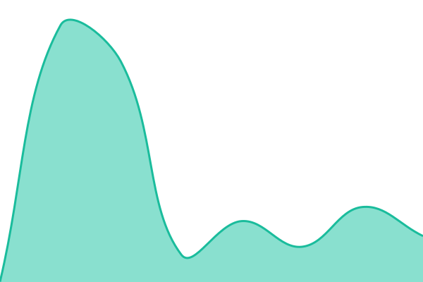 112ms
     
 | 

<a href="https://uptime.alliancecomp.com/history/cmb-contracting">100.00%</a>
    

|  [Critter Control](https://crittercontrolcentralpa.com) | 🟩 Up | [critter-control.yml](https://github.com/alliancewebteam/uptime/commits/HEAD/history/critter-control.yml) | 

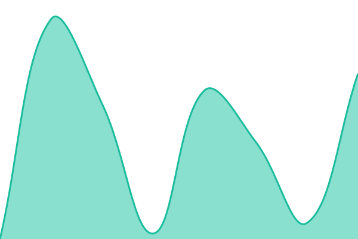 1322ms
     
 | 

<a href="https://uptime.alliancecomp.com/history/critter-control">100.00%</a>
    

|  [Dani's Pixel Place](https://danispixelplace.com) | 🟩 Up | [dani-s-pixel-place.yml](https://github.com/alliancewebteam/uptime/commits/HEAD/history/dani-s-pixel-place.yml) | 

 221ms
     
 | 

<a href="https://uptime.alliancecomp.com/history/dani-s-pixel-place">100.00%</a>
    

|  [Debi Vreeland Insurance](https://debivreelandinsurance.com) | 🟩 Up | [debi-vreeland-insurance.yml](https://github.com/alliancewebteam/uptime/commits/HEAD/history/debi-vreeland-insurance.yml) | 

 190ms
     
 | 

<a href="https://uptime.alliancecomp.com/history/debi-vreeland-insurance">100.00%</a>
    

|  [Dream Home Realty](https://dreamhrpa.com) | 🟩 Up | [dream-home-realty.yml](https://github.com/alliancewebteam/uptime/commits/HEAD/history/dream-home-realty.yml) | 

 123ms
     
 | 

<a href="https://uptime.alliancecomp.com/history/dream-home-realty">100.00%</a>
    

|  [Duffy's Bed And Biscuit](https://duffysbedandbiscuit.com) | 🟩 Up | [duffy-s-bed-and-biscuit.yml](https://github.com/alliancewebteam/uptime/commits/HEAD/history/duffy-s-bed-and-biscuit.yml) | 

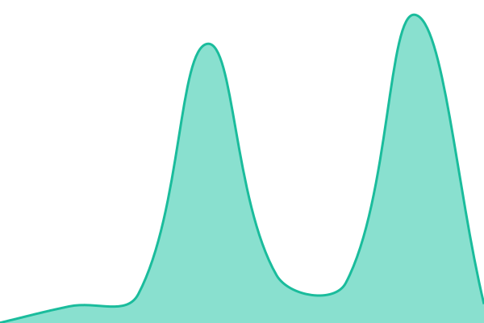 116ms
     
 | 

<a href="https://uptime.alliancecomp.com/history/duffy-s-bed-and-biscuit">100.00%</a>
    

|  [F&M Designs](https://fandmdesigns.com) | 🟩 Up | [f-and-m-designs.yml](https://github.com/alliancewebteam/uptime/commits/HEAD/history/f-and-m-designs.yml) | 

 125ms
     
 | 

<a href="https://uptime.alliancecomp.com/history/f-and-m-designs">100.00%</a>
    

|  [Fortney Printing](https://fortneyprinting.com) | 🟩 Up | [fortney-printing.yml](https://github.com/alliancewebteam/uptime/commits/HEAD/history/fortney-printing.yml) | 

 443ms
     
 | 

<a href="https://uptime.alliancecomp.com/history/fortney-printing">98.60%</a>
    

|  [Generation Bank](https://generationbankpa.com) | 🟩 Up | [generation-bank.yml](https://github.com/alliancewebteam/uptime/commits/HEAD/history/generation-bank.yml) | 

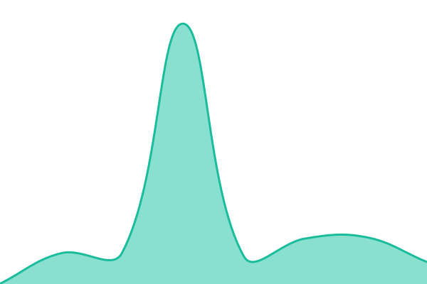 121ms
     
 | 

<a href="https://uptime.alliancecomp.com/history/generation-bank">100.00%</a>
    

|  [GES America](https://ges-america.com) | 🟩 Up | [ges-america.yml](https://github.com/alliancewebteam/uptime/commits/HEAD/history/ges-america.yml) | 

 313ms
     
 | 

<a href="https://uptime.alliancecomp.com/history/ges-america">96.92%</a>
    

|  [Guth Laboratories](https://guthlabs.com) | 🟩 Up | [guth-laboratories.yml](https://github.com/alliancewebteam/uptime/commits/HEAD/history/guth-laboratories.yml) | 

 131ms
     
 | 

<a href="https://uptime.alliancecomp.com/history/guth-laboratories">100.00%</a>
    

|  [Grassworks Landscaping](https://grassworkslandscaping.com) | 🟩 Up | [grassworks-landscaping.yml](https://github.com/alliancewebteam/uptime/commits/HEAD/history/grassworks-landscaping.yml) | 

 398ms
     
 | 

<a href="https://uptime.alliancecomp.com/history/grassworks-landscaping">100.00%</a>
    

|  [Grates Pro Painting](https://gratespropaintingpa.com) | 🟩 Up | [grates-pro-painting.yml](https://github.com/alliancewebteam/uptime/commits/HEAD/history/grates-pro-painting.yml) | 

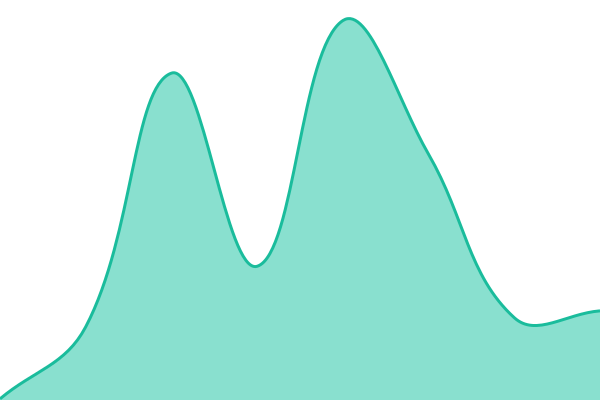 140ms
     
 | 

<a href="https://uptime.alliancecomp.com/history/grates-pro-painting">100.00%</a>
    

|  [Grove Miller Engineering](https://grovemiller.com) | 🟩 Up | [grove-miller-engineering.yml](https://github.com/alliancewebteam/uptime/commits/HEAD/history/grove-miller-engineering.yml) | 

 238ms
     
 | 

<a href="https://uptime.alliancecomp.com/history/grove-miller-engineering">98.70%</a>
    

|  [Habitat for Humanity of the Greater Harrisburg Area](https://harrisburghabitat.org) | 🟩 Up | [habitat-for-humanity-of-the-greater-harrisburg-area.yml](https://github.com/alliancewebteam/uptime/commits/HEAD/history/habitat-for-humanity-of-the-greater-harrisburg-area.yml) | 

 395ms
     
 | 

<a href="https://uptime.alliancecomp.com/history/habitat-for-humanity-of-the-greater-harrisburg-area">100.00%</a>
    

|  [Habitat for Humanity of the Greater Harrisburg Area - ReStore](https://harrisburgrestore.org) | 🟩 Up | [habitat-for-humanity-of-the-greater-harrisburg-area-re-store.yml](https://github.com/alliancewebteam/uptime/commits/HEAD/history/habitat-for-humanity-of-the-greater-harrisburg-area-re-store.yml) | 

 149ms
     
 | 

<a href="https://uptime.alliancecomp.com/history/habitat-for-humanity-of-the-greater-harrisburg-area-re-store">100.00%</a>
    

|  [Handyworx](https://thehandyworx.com) | 🟩 Up | [handyworx.yml](https://github.com/alliancewebteam/uptime/commits/HEAD/history/handyworx.yml) | 

 368ms
     
 | 

<a href="https://uptime.alliancecomp.com/history/handyworx">100.00%</a>
    

|  [Henry's Lock and Key Service](https://henryskeyandlockservice.com) | 🟩 Up | [henry-s-lock-and-key-service.yml](https://github.com/alliancewebteam/uptime/commits/HEAD/history/henry-s-lock-and-key-service.yml) | 

 108ms
     
 | 

<a href="https://uptime.alliancecomp.com/history/henry-s-lock-and-key-service">100.00%</a>
    

|  [Impact Harrisburg](https://impactharrisburg.org) | 🟩 Up | [impact-harrisburg.yml](https://github.com/alliancewebteam/uptime/commits/HEAD/history/impact-harrisburg.yml) | 

 166ms
     
 | 

<a href="https://uptime.alliancecomp.com/history/impact-harrisburg">100.00%</a>
    

|  [Indian Creek](https://indiancreekcommunity.org) | 🟩 Up | [indian-creek.yml](https://github.com/alliancewebteam/uptime/commits/HEAD/history/indian-creek.yml) | 

 312ms
     
 | 

<a href="https://uptime.alliancecomp.com/history/indian-creek">100.00%</a>
    

|  [Jaz Design Co](https://jazdesignco.com) | 🟩 Up | [jaz-design-co.yml](https://github.com/alliancewebteam/uptime/commits/HEAD/history/jaz-design-co.yml) | 

 412ms
     
 | 

<a href="https://uptime.alliancecomp.com/history/jaz-design-co">98.31%</a>
    

|  [John Jewett](https://jhowardcahill.com) | 🟩 Up | [john-jewett.yml](https://github.com/alliancewebteam/uptime/commits/HEAD/history/john-jewett.yml) | 

 2729ms
     
 | 

<a href="https://uptime.alliancecomp.com/history/john-jewett">96.82%</a>
    

|  [JM Mechanical LLC](https://jmmechanicalllc.com) | 🟩 Up | [jm-mechanical-llc.yml](https://github.com/alliancewebteam/uptime/commits/HEAD/history/jm-mechanical-llc.yml) | 

 80ms
     
 | 

<a href="https://uptime.alliancecomp.com/history/jm-mechanical-llc">100.00%</a>
    

|  [Juniper Environmental](https://juniperenviro.com) | 🟩 Up | [juniper-environmental.yml](https://github.com/alliancewebteam/uptime/commits/HEAD/history/juniper-environmental.yml) | 

 134ms
     
 | 

<a href="https://uptime.alliancecomp.com/history/juniper-environmental">100.00%</a>
    

|  [K Crew Hauling](https://kcrewhauling.com) | 🟩 Up | [k-crew-hauling.yml](https://github.com/alliancewebteam/uptime/commits/HEAD/history/k-crew-hauling.yml) | 

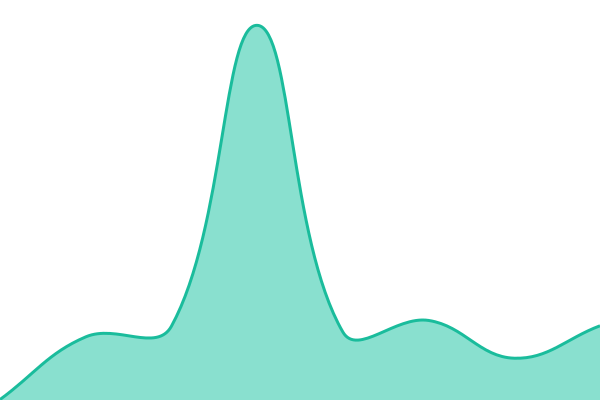 2323ms
     
 | 

<a href="https://uptime.alliancecomp.com/history/k-crew-hauling">100.00%</a>
    

|  [K Travels](https://ktravels.org) | 🟩 Up | [k-travels.yml](https://github.com/alliancewebteam/uptime/commits/HEAD/history/k-travels.yml) | 

 793ms
     
 | 

<a href="https://uptime.alliancecomp.com/history/k-travels">97.41%</a>
    

|  [The Law Office of Susan Smith](https://sjsmithlaw.com) | 🟩 Up | [the-law-office-of-susan-smith.yml](https://github.com/alliancewebteam/uptime/commits/HEAD/history/the-law-office-of-susan-smith.yml) | 

 344ms
     
 | 

<a href="https://uptime.alliancecomp.com/history/the-law-office-of-susan-smith">100.00%</a>
    

|  [Lets Talk Rockabilly](https://letstalkrockabilly.com) | 🟩 Up | [lets-talk-rockabilly.yml](https://github.com/alliancewebteam/uptime/commits/HEAD/history/lets-talk-rockabilly.yml) | 

 464ms
     
 | 

<a href="https://uptime.alliancecomp.com/history/lets-talk-rockabilly">100.00%</a>
    

|  [Long and Strong Thrower's Club](https://longandstrong.com) | 🟩 Up | [long-and-strong-thrower-s-club.yml](https://github.com/alliancewebteam/uptime/commits/HEAD/history/long-and-strong-thrower-s-club.yml) | 

 121ms
     
 | 

<a href="https://uptime.alliancecomp.com/history/long-and-strong-thrower-s-club">100.00%</a>
    

|  [Luhrs Center](https://luhrscenter.com) | 🟩 Up | [luhrs-center.yml](https://github.com/alliancewebteam/uptime/commits/HEAD/history/luhrs-center.yml) | 

 271ms
     
 | 

<a href="https://uptime.alliancecomp.com/history/luhrs-center">100.00%</a>
    

|  [Machining America](https://machiningamerica.com) | 🟩 Up | [machining-america.yml](https://github.com/alliancewebteam/uptime/commits/HEAD/history/machining-america.yml) | 

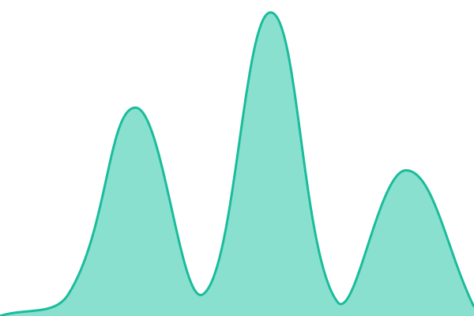 535ms
     
 | 

<a href="https://uptime.alliancecomp.com/history/machining-america">100.00%</a>
    

|  [Mason Dixon Distillery](https://masondixondistillery.com) | 🟩 Up | [mason-dixon-distillery.yml](https://github.com/alliancewebteam/uptime/commits/HEAD/history/mason-dixon-distillery.yml) | 

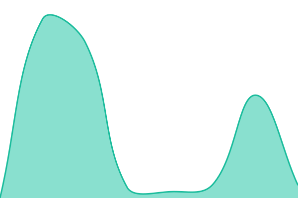 1620ms
     
 | 

<a href="https://uptime.alliancecomp.com/history/mason-dixon-distillery">100.00%</a>
    

|  [Melissa Mueller McCullough](https://smartloanadvisor.com) | 🟩 Up | [melissa-mueller-mc-cullough.yml](https://github.com/alliancewebteam/uptime/commits/HEAD/history/melissa-mueller-mc-cullough.yml) | 

 117ms
     
 | 

<a href="https://uptime.alliancecomp.com/history/melissa-mueller-mc-cullough">100.00%</a>
    

|  [Miller & Son Electro-Plating](https://millerplatingnj.com) | 🟩 Up | [miller-and-son-electro-plating.yml](https://github.com/alliancewebteam/uptime/commits/HEAD/history/miller-and-son-electro-plating.yml) | 

 222ms
     
 | 

<a href="https://uptime.alliancecomp.com/history/miller-and-son-electro-plating">98.89%</a>
    

|  [Mr Sandman Flooring](https://callmrsandman.com) | 🟩 Up | [mr-sandman-flooring.yml](https://github.com/alliancewebteam/uptime/commits/HEAD/history/mr-sandman-flooring.yml) | 

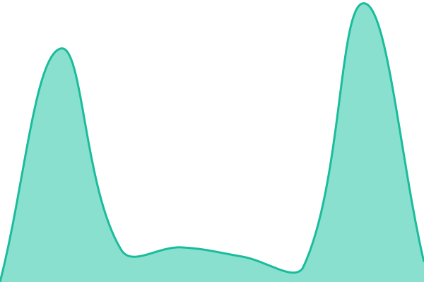 922ms
     
 | 

<a href="https://uptime.alliancecomp.com/history/mr-sandman-flooring">100.00%</a>
    

|  [My Amerilock](https://myamerilock.com) | 🟩 Up | [my-amerilock.yml](https://github.com/alliancewebteam/uptime/commits/HEAD/history/my-amerilock.yml) | 

 2730ms
     
 | 

<a href="https://uptime.alliancecomp.com/history/my-amerilock">98.94%</a>
    

|  [My Identity First](https://myidentityfirst.com) | 🟩 Up | [my-identity-first.yml](https://github.com/alliancewebteam/uptime/commits/HEAD/history/my-identity-first.yml) | 

 2583ms
     
 | 

<a href="https://uptime.alliancecomp.com/history/my-identity-first">100.00%</a>
    

|  [PrimeFyre LLC](https://primefyre.com) | 🟩 Up | [prime-fyre-llc.yml](https://github.com/alliancewebteam/uptime/commits/HEAD/history/prime-fyre-llc.yml) | 

 300ms
     
 | 

<a href="https://uptime.alliancecomp.com/history/prime-fyre-llc">100.00%</a>
    

|  [Ramsey's Payment Pros](https://ramseypaymentpros.com/) | 🟩 Up | [ramsey-s-payment-pros.yml](https://github.com/alliancewebteam/uptime/commits/HEAD/history/ramsey-s-payment-pros.yml) | 

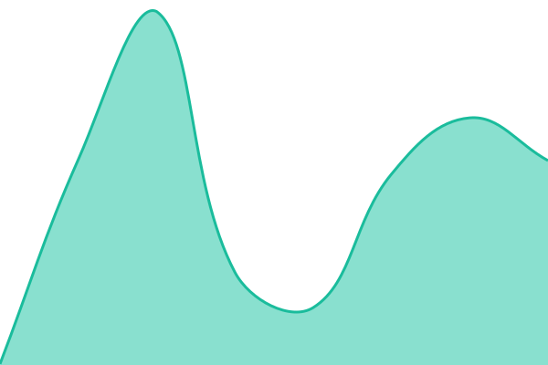 247ms
     
 | 

<a href="https://uptime.alliancecomp.com/history/ramsey-s-payment-pros">100.00%</a>
    

|  [Reach For More](https://reachformore.fit) | 🟩 Up | [reach-for-more.yml](https://github.com/alliancewebteam/uptime/commits/HEAD/history/reach-for-more.yml) | 

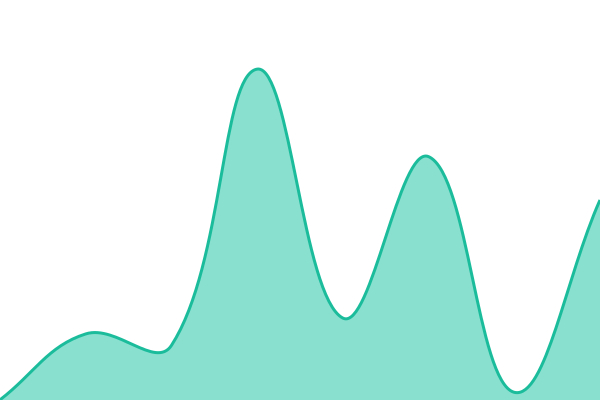 376ms
     
 | 

<a href="https://uptime.alliancecomp.com/history/reach-for-more">100.00%</a>
    

|  [Redd's Smokehouse BBQ](https://reddssmokehousebbq.com) | 🟩 Up | [redd-s-smokehouse-bbq.yml](https://github.com/alliancewebteam/uptime/commits/HEAD/history/redd-s-smokehouse-bbq.yml) | 

 432ms
     
 | 

<a href="https://uptime.alliancecomp.com/history/redd-s-smokehouse-bbq">100.00%</a>
    

|  [Redd's Smokehouse BBQ](https://robinsdocksideshop.com) | 🟩 Up | [redd-s-smokehouse-bbq.yml](https://github.com/alliancewebteam/uptime/commits/HEAD/history/redd-s-smokehouse-bbq.yml) | 

 432ms
     
 | 

<a href="https://uptime.alliancecomp.com/history/redd-s-smokehouse-bbq">100.00%</a>
    

|  [Ruthcliffe Lodge & Restaurant](https://ruthcliffe.com) | 🟩 Up | [ruthcliffe-lodge-and-restaurant.yml](https://github.com/alliancewebteam/uptime/commits/HEAD/history/ruthcliffe-lodge-and-restaurant.yml) | 

 142ms
     
 | 

<a href="https://uptime.alliancecomp.com/history/ruthcliffe-lodge-and-restaurant">100.00%</a>
    

|  [Remod Squad](https://remodsquad.com) | 🟩 Up | [remod-squad.yml](https://github.com/alliancewebteam/uptime/commits/HEAD/history/remod-squad.yml) | 

 185ms
     
 | 

<a href="https://uptime.alliancecomp.com/history/remod-squad">100.00%</a>
    

|  [Saidis, Shultz, & Fisher](https://ssfadvocates.com) | 🟩 Up | [saidis-shultz-and-fisher.yml](https://github.com/alliancewebteam/uptime/commits/HEAD/history/saidis-shultz-and-fisher.yml) | 

 127ms
     
 | 

<a href="https://uptime.alliancecomp.com/history/saidis-shultz-and-fisher">100.00%</a>
    

|  [Savannah's on Hanna](https://sohclub.com) | 🟩 Up | [savannah-s-on-hanna.yml](https://github.com/alliancewebteam/uptime/commits/HEAD/history/savannah-s-on-hanna.yml) | 

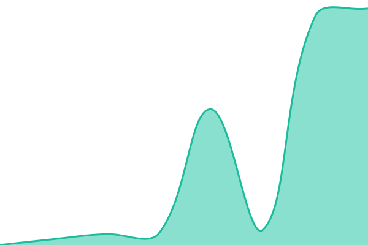 821ms
     
 | 

<a href="https://uptime.alliancecomp.com/history/savannah-s-on-hanna">100.00%</a>
    

|  [Sebastian Electric LLC](https://sebastian-electric.com) | 🟩 Up | [sebastian-electric-llc.yml](https://github.com/alliancewebteam/uptime/commits/HEAD/history/sebastian-electric-llc.yml) | 

 92ms
     
 | 

<a href="https://uptime.alliancecomp.com/history/sebastian-electric-llc">100.00%</a>
    

|  [Shepherd's Driver Consulting](https://shepherdsdriverconsulting.com) | 🟩 Up | [shepherd-s-driver-consulting.yml](https://github.com/alliancewebteam/uptime/commits/HEAD/history/shepherd-s-driver-consulting.yml) | 

 98ms
     
 | 

<a href="https://uptime.alliancecomp.com/history/shepherd-s-driver-consulting">100.00%</a>
    

|  [Shippensburg News](https://news.ship.edu) | 🟩 Up | [shippensburg-news.yml](https://github.com/alliancewebteam/uptime/commits/HEAD/history/shippensburg-news.yml) | 

 318ms
     
 | 

<a href="https://uptime.alliancecomp.com/history/shippensburg-news">100.00%</a>
    

|  [Shippensburg University 150th Anniversary](https://150.ship.edu) | 🟩 Up | [shippensburg-university-150th-anniversary.yml](https://github.com/alliancewebteam/uptime/commits/HEAD/history/shippensburg-university-150th-anniversary.yml) | 

 484ms
     
 | 

<a href="https://uptime.alliancecomp.com/history/shippensburg-university-150th-anniversary">98.27%</a>
    

|  [Sirianna Therapy](https://siriannatherapy.com) | 🟩 Up | [sirianna-therapy.yml](https://github.com/alliancewebteam/uptime/commits/HEAD/history/sirianna-therapy.yml) | 

 111ms
     
 | 

<a href="https://uptime.alliancecomp.com/history/sirianna-therapy">100.00%</a>
    

|  [SSF Advocates](https://ssfadvocates.com) | 🟩 Up | [ssf-advocates.yml](https://github.com/alliancewebteam/uptime/commits/HEAD/history/ssf-advocates.yml) | 

 29ms
     
 | 

<a href="https://uptime.alliancecomp.com/history/ssf-advocates">100.00%</a>
    

|  [Strategic Response Firearms Training](https://srft16.com/) | 🟩 Up | [strategic-response-firearms-training.yml](https://github.com/alliancewebteam/uptime/commits/HEAD/history/strategic-response-firearms-training.yml) | 

 356ms
     
 | 

<a href="https://uptime.alliancecomp.com/history/strategic-response-firearms-training">98.99%</a>
    

|  [Strube Inc.](https://strubeinc.net) | 🟩 Up | [strube-inc.yml](https://github.com/alliancewebteam/uptime/commits/HEAD/history/strube-inc.yml) | 

 117ms
     
 | 

<a href="https://uptime.alliancecomp.com/history/strube-inc">100.00%</a>
    

|  [Summerdale Apartments](https://summerdaleapartments.com) | 🟩 Up | [summerdale-apartments.yml](https://github.com/alliancewebteam/uptime/commits/HEAD/history/summerdale-apartments.yml) | 

 91ms
     
 | 

<a href="https://uptime.alliancecomp.com/history/summerdale-apartments">100.00%</a>
    

|  [Szeles and Associates](https://szelesas.com) | 🟩 Up | [szeles-and-associates.yml](https://github.com/alliancewebteam/uptime/commits/HEAD/history/szeles-and-associates.yml) | 

 515ms
     
 | 

<a href="https://uptime.alliancecomp.com/history/szeles-and-associates">99.03%</a>
    

|  [The Meadows Pet Resort](https://themeadowspetresort.com) | 🟩 Up | [the-meadows-pet-resort.yml](https://github.com/alliancewebteam/uptime/commits/HEAD/history/the-meadows-pet-resort.yml) | 

 235ms
     
 | 

<a href="https://uptime.alliancecomp.com/history/the-meadows-pet-resort">100.00%</a>
    

|  [United Sustainable Ag](https://unitedsustainableag.com) | 🟩 Up | [united-sustainable-ag.yml](https://github.com/alliancewebteam/uptime/commits/HEAD/history/united-sustainable-ag.yml) | 

 498ms
     
 | 

<a href="https://uptime.alliancecomp.com/history/united-sustainable-ag">99.46%</a>
    

|  [V3 Fitness Pro](https://v3fitnesspro.com) | 🟩 Up | [v3-fitness-pro.yml](https://github.com/alliancewebteam/uptime/commits/HEAD/history/v3-fitness-pro.yml) | 

 142ms
     
 | 

<a href="https://uptime.alliancecomp.com/history/v3-fitness-pro">100.00%</a>
    

|  [Wert Book Binding](https://wertbookbinding.com) | 🟩 Up | [wert-book-binding.yml](https://github.com/alliancewebteam/uptime/commits/HEAD/history/wert-book-binding.yml) | 

 230ms
     
 | 

<a href="https://uptime.alliancecomp.com/history/wert-book-binding">100.00%</a>
    

|  [West Shore Elks](https://westshoreelks.org) | 🟩 Up | [west-shore-elks.yml](https://github.com/alliancewebteam/uptime/commits/HEAD/history/west-shore-elks.yml) | 

 284ms
     
 | 

<a href="https://uptime.alliancecomp.com/history/west-shore-elks">100.00%</a>
    

|  [Wheelhouse Rentals](https://wheelhouserentals.com/) | 🟩 Up | [wheelhouse-rentals.yml](https://github.com/alliancewebteam/uptime/commits/HEAD/history/wheelhouse-rentals.yml) | 

 125ms
     
 | 

<a href="https://uptime.alliancecomp.com/history/wheelhouse-rentals">100.00%</a>
    

|  [Wide Horizons Travel](https://widehorizonstravel.com) | 🟩 Up | [wide-horizons-travel.yml](https://github.com/alliancewebteam/uptime/commits/HEAD/history/wide-horizons-travel.yml) | 

 441ms
     
 | 

<a href="https://uptime.alliancecomp.com/history/wide-horizons-travel">100.00%</a>
    

|  [Woodburn Law](https://woodburn-law.com) | 🟩 Up | [woodburn-law.yml](https://github.com/alliancewebteam/uptime/commits/HEAD/history/woodburn-law.yml) | 

 300ms
     
 | 

<a href="https://uptime.alliancecomp.com/history/woodburn-law">97.40%</a>
    

|  [Yard Work Properties LLC](https://yardworkpropertiesllc.com) | 🟩 Up | [yard-work-properties-llc.yml](https://github.com/alliancewebteam/uptime/commits/HEAD/history/yard-work-properties-llc.yml) | 

 377ms
     
 | 

<a href="https://uptime.alliancecomp.com/history/yard-work-properties-llc">100.00%</a>
    

|  [Yorklyn Construction](https://yorklynconstruction.com) | 🟩 Up | [yorklyn-construction.yml](https://github.com/alliancewebteam/uptime/commits/HEAD/history/yorklyn-construction.yml) | 

 115ms
     
 | 

<a href="https://uptime.alliancecomp.com/history/yorklyn-construction">100.00%</a>
    

|  [Zang Physical Therapy](https://zangpt.com) | 🟩 Up | [zang-physical-therapy.yml](https://github.com/alliancewebteam/uptime/commits/HEAD/history/zang-physical-therapy.yml) | 

 161ms
     
 | 

<a href="https://uptime.alliancecomp.com/history/zang-physical-therapy">100.00%</a>
    

<!--end: status pages-->

[**Visit our status website →**](https://uptime.alliancecomp.com)

## 📄 License

- Powered by: [Upptime](https://github.com/upptime/upptime)
- Code: [MIT](./LICENSE) © [Anand Chowdhary](https://anandchowdhary.com), supported by [Pabio](https://pabio.com)
- Data in the `./history` directory: [Open Database License](https://opendatacommons.org/licenses/odbl/1-0/)
